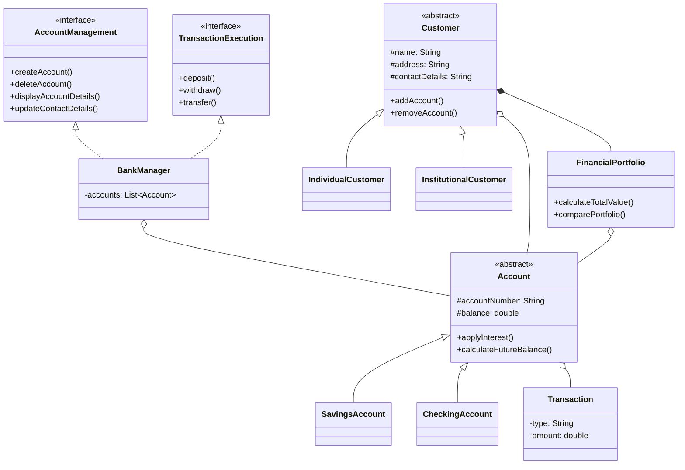
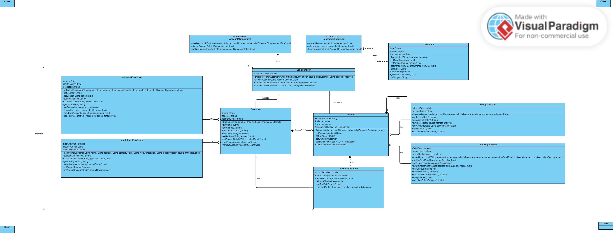

# BankManager

Java OOP bank simulation: customers, savings/checking accounts, deposits, withdrawals, transfers and a simple portfolio view. Originally a coursework UML project; this revision opens the source in a Maven layout, fixes account ownership, and routes money movement through `BankManager`.

## Features

- Individual and institutional customers
- Savings and checking accounts with interest helpers
- Account lifecycle via `AccountManagement`
- Deposits, withdrawals and transfers via `TransactionExecution`
- Per-customer financial portfolio totals

## Domain model



Course UML diagram (Visual Paradigm):



## Quick start

```bash
./mvnw test
./mvnw -q exec:java
```

On Windows:

```bat
mvnw.cmd test
mvnw.cmd -q exec:java
```

## Notes

- Interest rates are annual percentages (for example `1.5` means 1.5%).
- Transfers fail when the source account has insufficient funds; balances stay unchanged.
- Account numbers must be unique inside one `BankManager` instance.

## License

MIT

## Maintenance

Small doc touch-ups land through pull requests.


